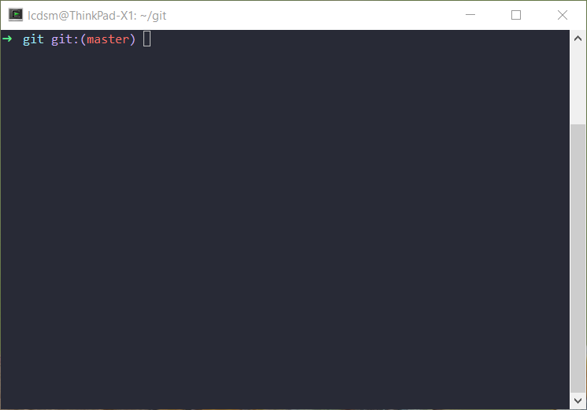

1. Install cygwin.

Download [cygwin installer](https://www.cygwin.com/) then execute:

``` 
./setup-x86_64.exe -q -P git,vim,curl,wget,zsh,chere
```

2. Install [oh-my-zsh](https://github.com/robbyrussell/oh-my-zsh).

```
git clone https://github.com/robbyrussell/oh-my-zsh.git ~/.oh-my-zsh
cp ~/.oh-my-zsh/templates/zshrc.zsh-template ~/.zshrc
```

3. Make zsh as the default shell.

Add following line to the top of `~/.bashrc`:

```
exec zsh
```

4. (Optional) Add cygwin to right-click context menu.

Run cygwin as administrator and execute:

```
chere -i -t mintty -s bash
```

5. (Optional) Use cygwin as integrated terminal in IDE (IDEA, VS Code, etc.).

Create a bat file named `Cygwin-integrated.bat` under `C:\cygwin64` with following content:

```bat
@echo off
set CHERE_INVOKING=1
C:\cygwin64\bin\bash.exe --login -i
```

Make it executable:

```
chmod +x Cygwin-integrated.bat
```

Edit VS Code user settings (other IDEs are similar):

```
"terminal.integrated.shell.windows": "C:\\cygwin64\\Cygwin-integrated.bat"`
```
