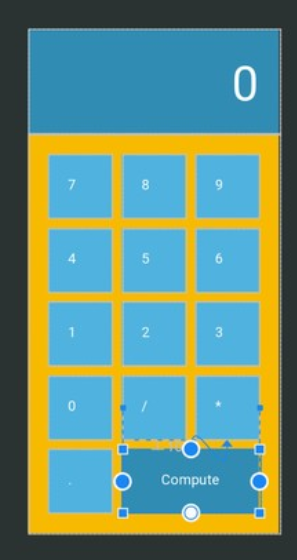

+++
title = "Say goodbye to LinearLayout with Flow"
date = 2019-04-27
+++

`ConstraintLayout:2.0.0-alpha5` brings a new helper class `Flow` which can perfectly replace the linear layout in a handy way.
Sometimes we may just want to create a list with some fixed items distributed vertically:

### Previous Approaches

LinearLayout with vertical orientation can simply create a list like this. However, if we want to embed the list into a complex layout creating with ConstraintLayout, the XML layout file can lead to a **deep view** hierarchy.

To flat the view hierarchy, we can set the constraint of each item view to achieving the same result:

However, this approach has some drawbacks:

- Each item view needs to reference their neighbors' id which makes the add/remove/swap views not very convenient when we editing the XML file.
- The margin must be set in each view which is cumbersome although using GuideLine and style can slightly alleviate this problem.

### New Approach with Flow

The virtual view `Flow` introduced in `ConstraintLayout:2.0.0-alpha5` can perfectly solve these problems. The example below create the same layout but with fewer codes and give more flexible control:

Notice that each item view doesn’t need to write any constraints. By setting the referenced ids in Flow: `app:constraint_referenced_ids="text1,text2,text3,text4"` we can simply control the align style, margins and et al. of each item view. The whole example can be found in [https://github.com/lcdsmao/FlowExample](https://github.com/lcdsmao/FlowExample).

The document provides a more detailed description of all attributes of Flow: [https://developer.android.com/reference/android/support/constraint/helper/Flow](https://developer.android.com/reference/android/support/constraint/helper/Flow).

There are other advantages to using Flow. Since we write all items views in a flat hierarchy, other sibling views can still reference these item views for creating a more complex layout.

This awesome talk shows how to create a calculator using Flow:

### Summary

`Flow` provides a simple way and flexible APIs for creating linear or grid layout in ConstraintLayout and still keep the view in a flat hierarchy.
