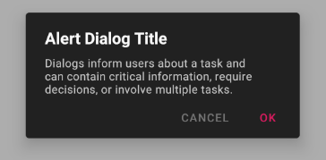
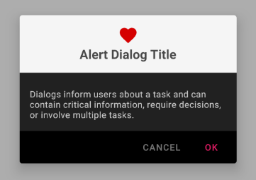

## Prerequisites

Add [material design dependency](https://mvnrepository.com/artifact/com.google.android.material/material) in Gradle file:

```gradle
implementation "com.google.android.material:material:<latest-version>"
```

Make sure your `AppTheme` inherited from a material theme like:

```xml
<style name="AppTheme" parent="Theme.MaterialComponents.Light.DarkActionBar">
```

## Customization

Create a custom alert dialog theme that inherited from `ThemeOverlay.MaterialComponents.MaterialAlertDialog`:

```xml
<style name="AlertDialogTheme" parent="ThemeOverlay.MaterialComponents.MaterialAlertDialog"></style>
```

Then you can then customize the style of the title, body, button, or other elements by overriding the corresponding item in the alert dialog theme.

For example, customize the text color and font size of the title by creating a `materialAlertDialogTitleTextStyle` that inherited from `MaterialAlertDialog.MaterialComponents.Title.Text`:

```xml
<style name="AlertDialogTheme" parent="...">
    <item name="materialAlertDialogTitleTextStyle">@style/TitleTextStyle</item>
</style>
<style name="TitleTextStyle" parent="MaterialAlertDialog.MaterialComponents.Title.Text">
    <item name="android:textColor">#fafafa</item>
    <item name="android:textSize">20sp</item>
</style>
```

## Examples

### Example 1:



Change the background color and define the style for title text, body text, positive and negative button:

```xml
<style name="AlertDialogTheme" parent="ThemeOverlay.MaterialComponents.MaterialAlertDialog">
    <item name="colorSurface">#212121</item>
    <item name="materialAlertDialogTitleTextStyle">@style/TitleTextStyle</item>
    <item name="materialAlertDialogBodyTextStyle">@style/BodyTextStyle</item>
    <item name="buttonBarPositiveButtonStyle">@style/PositiveButtonStyle</item>
    <item name="buttonBarNegativeButtonStyle">@style/NegativeButtonStyle</item>
</style>
<style name="TitleTextStyle" parent="MaterialAlertDialog.MaterialComponents.Title.Text">
    <item name="android:textColor">#fafafa</item>
    <item name="android:textStyle">bold</item>
    <item name="android:textSize">20sp</item>
</style>
<style name="BodyTextStyle" parent="MaterialAlertDialog.MaterialComponents.Body.Text">
    <item name="android:textColor">#c7c7c7</item>
    <item name="android:textSize">14sp</item>
</style>
<style name="PositiveButtonStyle" parent="Widget.MaterialComponents.Button.TextButton.Dialog">
    <item name="android:textColor">#d81b60</item>
    <item name="rippleColor">#ad1457</item>
</style>
<style name="NegativeButtonStyle" parent="Widget.MaterialComponents.Button.TextButton.Dialog">
    <item name="android:textColor">#757575</item>
    <item name="rippleColor">#a4a4a4</item>
</style>
```

To apply the custom theme to the dialog you need to use the `MaterialAlertDialogBuilder` and pass the theme id to it:

```kotlin
MaterialAlertDialogBuilder(context, R.styles.AlertDialogTheme)
    .setTitle(R.string.title)
    .setMessage(R.string.message)
    .setPositiveButton(R.string.positive, ...)
    .setNegativeButton(R.string.negative, ...)
    .create()
```

If you want to let every dialog use the same theme, then override the `materialAlertDialogTheme` attribute it in your `AppTheme`:

```xml
<style name="AppTheme" parent="Theme.MaterialComponents.Light.DarkActionBar">
    <item name="materialAlertDialogTheme">@style/AlertDialogTheme</item>
</style>
```

Now the `context` will provide custom dialog theme instead of the default one.
You can initialize the dialog builder without the theme parameter:

```kotlin
MaterialAlertDialogBuilder(context).setTitle()...
```

## Example 2:



Let the title and icon center and set different colors to title pane and button bar:

```xml
<style name="AlertDialogTheme.Center" parent="ThemeOverlay.MaterialComponents.MaterialAlertDialog">
    <item name="colorSurface">#212121</item>
    <item name="materialAlertDialogTitlePanelStyle">@style/TitlePaneStyleCenter</item>
    <item name="materialAlertDialogTitleTextStyle">@style/TitleTextStyleCenter</item>
    <item name="materialAlertDialogTitleIconStyle">@style/TitleIconStyleCenter</item>
    <item name="materialAlertDialogBodyTextStyle">@style/BodyTextStyleCenter</item>
    <item name="buttonBarStyle">@style/ButtonBarStyle</item>
    <item name="buttonBarPositiveButtonStyle">@style/PositiveButtonStyle</item>
    <item name="buttonBarNegativeButtonStyle">@style/NegativeButtonStyle</item>
</style>
<style name="TitlePaneStyleCenter" parent="MaterialAlertDialog.MaterialComponents.Title.Panel.CenterStacked">
    <item name="android:background">#f5f5f5</item>
    <item name="android:padding">16dp</item>
</style>
<style name="TitleIconStyleCenter" parent="MaterialAlertDialog.MaterialComponents.Title.Icon.CenterStacked">
    <item name="android:tint">#d50000</item>
</style>
<style name="TitleTextStyleCenter" parent="MaterialAlertDialog.MaterialComponents.Title.Text.CenterStacked">
    <item name="android:textColor">#484848</item>
    <item name="android:textStyle">bold</item>
    <item name="android:textSize">20sp</item>
</style>
<style name="BodyTextStyleCenter" parent="MaterialAlertDialog.MaterialComponents.Body.Text">
    <item name="android:padding">16dp</item>
    <item name="android:textColor">#c7c7c7</item>
    <item name="android:textSize">14sp</item>
</style>
<style name="ButtonBarStyle">
    <item name="android:background">#000000</item>
</style>
```

## Conclusion

MaterialAlertDialog provides a beautiful base style and you can easily customize the style with writing some XML.

The example code can be found at [https://github.com/lcdsmao/CustomMaterialAlertDialog](https://github.com/lcdsmao/CustomMaterialAlertDialog)
